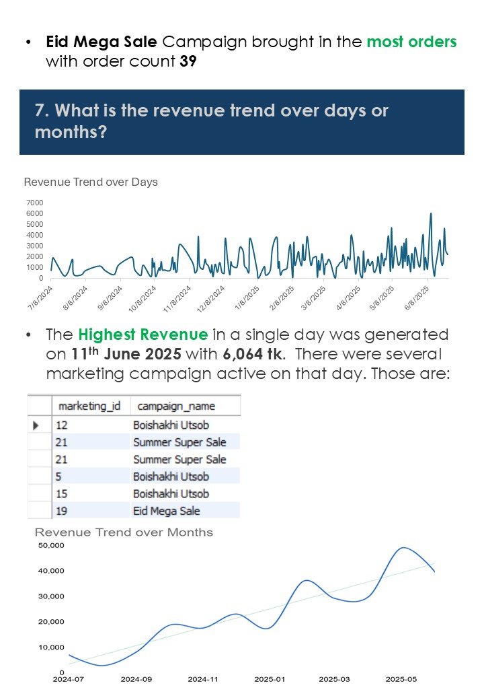

# SK Mart – Retail Shop Case Study (SQL Analysis)

This project presents a SQL-based case study analyzing SK Mart, a growing retail chain in Dhaka, Bangladesh. It includes SQL queries, data analysis, and business insights to help SK Mart optimize operations and understand customer behavior.

## 📊 Slides Overview

Below are the slides included in the project:

---

## 🧠 Purpose

- Analyze customer behavior
- Track sales and marketing impact
- Improve product performance
- Drive data-driven business decisions

---

## 🛠️ Tools Used

- MySQL
- SQL Window Functions
- Excel & Google Sheets for Chart Generation

---

## 📁 Repository Structure

